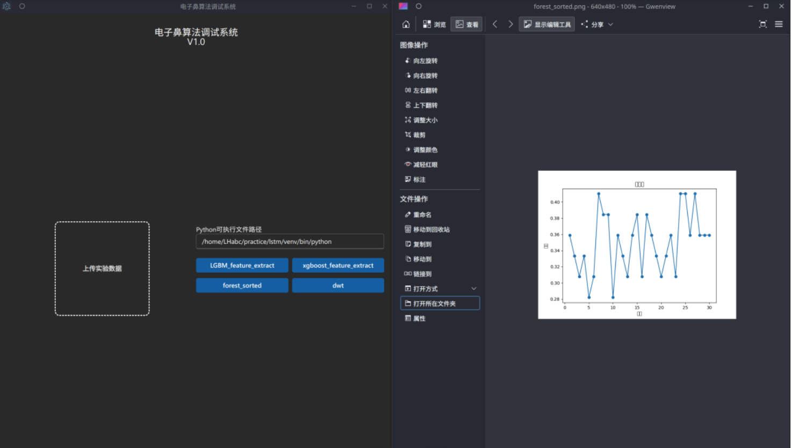
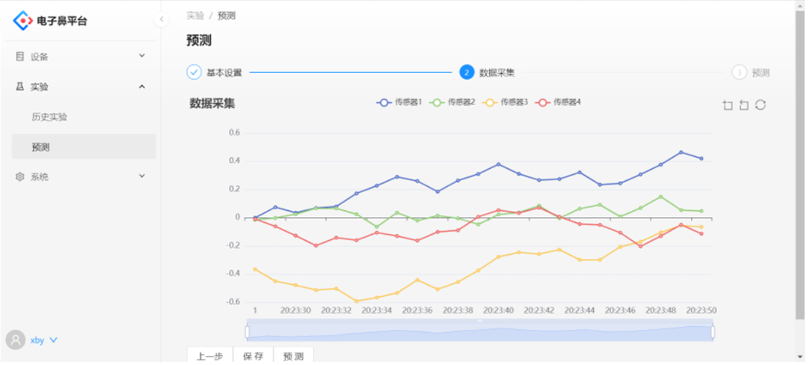

<div style="text-align:center">
  
</div>

# 📌 Diab-Enose: Non-Invasive Blood Glucose Detection System Based on Bionic Olfaction
<p align="center">
  
</p>

# 📌 Overview

This project focuses on non-invasive blood glucose detection using electronic nose (Enose) technology. The system collects and analyzes gas data from users' breath through embedded devices and deep learning models, ultimately presenting the glucose level in a mobile app. 

The project consists of four subsystems:

- **Enose Web Platform System**: A decoupled front-end and back-end system that supports experimental workflow management.
- **Enose Algorithm Debugging System**: A module for model debugging and algorithm invocation.
- **Enose Serial Communication Tool**: A utility for real-time sensor data acquisition and visualization.
- **Enose Algorithm Model**: Please refer to the paper: [DynaTGNet](https://link.springer.com/chapter/10.1007/978-981-96-6954-7_32): Enhanced Transformer-Based Spatiotemporal Dynamic Graph Neural Network for Multivariate Time Series Classification.


# 📂 Project Structure
```bash
Enose-Project
├── web-detection # Web management frontend and backend
├── data-collector # Serial port monitor software for sensor data acquisition
├── algorithm-debugging-system # Desktop application for AI model debugging, training, and inference visualization
├── ...
```

# 📦 Module Introduction
## 1️⃣ WebPlatform
- Frontend: `Reat + Ant Design + UmiJS + Axios`
- Backend: `Go + Gin + GORM + MySQL`
- Main features:
  - User registration and login
  - Device and sensor management
  - Experiment creation and result visualization
  - Model invocation and prediction
- Future integration with advanced multivariate time series classification algorithms such as DynaTGNet
- How to run:
```bash
# Frontend
cd WebPlatform/frontend
yarn install
yarn start

# Backend
cd WebPlatform/backend
go run main.go
```

## 2️⃣ AlgorithmClient
- Built with: `Electron + React + Fluent UI`
- Supported algorithms: LightGBM, XGBoost, Random Forest, etc.
- Main features:
  - Upload experimental data
  - Configure Python environment path
  - Debug algorithms and invoke models
  - Output visualization charts and logs
- How to run:
```bash
cd AlgorithmClient
yarn install
yarn start
```

## 3️⃣ SerialMonitor
- Tech stack: `Electron + React + Fluent UI + ECharts + SerialPort`
- Main features:
  - Real-time series visualization of sensor data
  - Serial port parameter configuration (baud rate, parity, etc.)
  - Save and manage data in Excel format
  - Support multiple data formats (decimal / hexadecimal / ASCII)
- How to run:
```bash
cd SerialMonitor
yarn install
yarn dev
```

# 🔍 Demo
<table>
  <tr>
    <td></td>
    <td></td>
    <td></td>
  </tr>
  <tr>
    <td></td>
    <td></td>
    <td></td>
  </tr>
  <tr>
    <td></td>
    <td></td>
    <td></td>
  </tr>
</table>


# ⚙️ Environment Requirements
- Node.js >= 14
- Go >= 1.17
- MySQL >= 8.0
- Python >= 3.8 (Anaconda environment recommended)
- Operating System: Windows 10 or CentOS 8+


# Development Team
This project is jointly developed by an interdisciplinary team from the College of Software, College of Business, Clinical Medical College, and College of Bionics at Jilin University.


# Awards
This project has received multiple awards, including the **National Third Prize** in the China University Service Outsourcing Innovation and Entrepreneurship Competition!

# Demo Video
<video controls width="100%">
  <source src="./img/Diab-Enose_Video.mp4" type="video/mp4">
  Your browser does not support the video tag.
</video>


